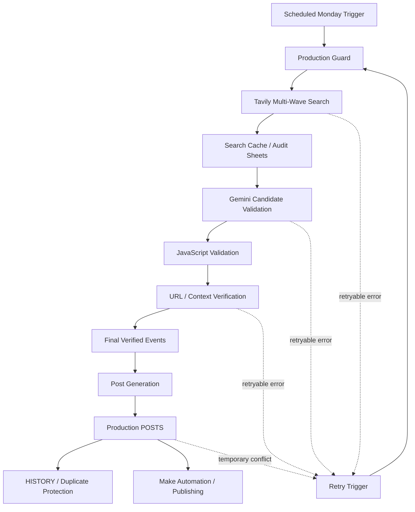

# Βυσσινί Ατζέντα

### Automated Sports Information Discovery, Validation & Publishing Pipeline

The **Βυσσινί Ατζέντα** is an automation project designed to discover upcoming sports events related to AEL Larissa, validate the information using multiple evidence layers and AI-assisted analysis, and prepare verified content for publication.

The project was developed as a practical automation/data-processing system using **Google Apps Script, Tavily API, Gemini API, Google Sheets and Make**.

> **Portfolio note:** This repository contains the production-side Google Apps Script. API keys, spreadsheet IDs and other private configuration values are intentionally excluded from source control.

---

## What the system does

The pipeline runs on a weekly schedule and:

1. Determines the current Monday–Sunday reporting window.
2. Searches multiple web sources through Tavily.
3. Organizes search results by AEL department/sport.
4. Uses Gemini to identify likely real events from raw search results.
5. Performs a second validation layer in JavaScript.
6. Performs URL/context verification for the selected events.
7. Uses source relevance and evidence scoring to reduce false positives.
8. Writes audit/staging results to dedicated Google Sheets.
9. Generates the final post content.
10. Commits the post to the production `POSTS` sheet.
11. Uses `HISTORY` to prevent duplicate weekly publication.
12. Uses retries, caching, locking and time-budget checks to survive transient API or Apps Script execution failures.

---

## Architecture



### Main components

| Component | Purpose |
|---|---|
| Google Apps Script | Core orchestration and business logic |
| Tavily API | Web discovery / candidate collection |
| Gemini API | AI-assisted event validation and source-context verification |
| Google Sheets | Production data, audit data and publication state |
| Make | Downstream automation / publishing |
| Script Properties | API keys and private runtime configuration |
| Apps Script Triggers | Weekly execution and delayed retries |

---

## Validation strategy

A key design goal is to **avoid trusting a single search result or a single AI response**.

The pipeline therefore uses multiple stages:

### 1. Discovery

Tavily searches a configured set of queries and sources.

### 2. AI-assisted validation

Gemini receives normalized candidates and identifies events that appear to satisfy the configured criteria.

### 3. Deterministic validation

JavaScript checks the returned matches against:

- allowed department IDs
- reporting-week dates
- source evidence
- event-like content
- AEL-specific relevance
- opponent/date consistency
- source quality

### 4. URL/context verification

Selected matches are checked again using their source context before they become final matches.

This hybrid approach combines **web search + LLM reasoning + deterministic rules**, rather than treating an LLM response as the final source of truth.

---

## Reliability mechanisms

The project was designed around real execution constraints of Google Apps Script and external APIs.

### Locking

`LockService` prevents overlapping pipeline executions.

### Retry handling

Retryable failures are scheduled for a later execution instead of immediately failing the whole weekly workflow.

### Caching

Tavily results can be cached for the active reporting week so a retry can continue without unnecessarily repeating the discovery phase.

### Time-budget protection

The pipeline checks elapsed execution time before expensive stages so that it can schedule a retry instead of running into the Apps Script execution limit.

### Pending-post recovery

If research and validation succeed but the production sheet cannot be updated temporarily, the generated post is stored in Script Properties and the retry can perform only the final commit.

### Duplicate protection

The `HISTORY` sheet is used to prevent a weekly post from being published more than once.

---

## Repository structure

```text
vyssini-agenda/
├── src/
│   ├── mondayPipelineProduction.gs
│   └── setup.gs
├── docs/
│   ├── architecture.md
│   └── configuration.md
├── appsscript.json
├── .gitignore
├── README.md
├── SECURITY.md
└── LICENSE
```

---

## Configuration

Private configuration is stored in **Google Apps Script → Project Settings → Script Properties**.

Required properties:

```text
PRODUCTION_SPREADSHEET_ID
TAVILY_API_KEY
GEMINI_API_KEY
```

Optional properties:

```text
AUDIT_SPREADSHEET_ID
GEMINI_MODEL
```

If `AUDIT_SPREADSHEET_ID` is not supplied, the production spreadsheet is used for the audit sheets as well.

The source code never contains the actual values.

### Suggested model property

```text
GEMINI_MODEL=gemini-3.6-flash
```

The code also falls back to this model name when the property is absent.

---

## Google Sheets layout

The production workbook is expected to contain:

```text
SOURCES
POSTS
HISTORY
```

The audit/staging workbook is expected to contain:

```text
SEARCH_TEST_V3
FINAL_TEST
POST_TEST
```

The `SOURCES` sheet provides the source configuration used by the discovery stage.

---

## Setup

### 1. Create/open a Google Apps Script project

Create a standalone Apps Script project or attach the files to the spreadsheet that will host the workflow.

### 2. Add the source files

Add:

```text
src/mondayPipelineProduction.gs
src/setup.gs
```

and use the contents of `appsscript.json` as the Apps Script manifest.

### 3. Configure Script Properties

Add the required properties described above.

**Never put API keys directly in `.gs` files.**

### 4. Run the configuration check

Run:

```text
validateProjectConfiguration
```

It checks that the required properties exist without printing their secret values.

### 5. Create the weekly trigger

The project includes:

```text
createMondayProductionTrigger()
```

The production pipeline itself also contains a Monday guard, so an accidental trigger execution on another day will not start a new weekly run.

---

## Important design choice

The repository does **not** contain:

- API keys
- Google Spreadsheet IDs
- Make webhook URLs
- OAuth credentials
- personal credentials
- private runtime data

Those values belong in the runtime environment, not in GitHub.

---

## Current scope

The production configuration currently covers the active AEL departments defined in the project, including football, futsal, basketball youth/men, volleyball and boxing categories.

The search strategy is configured with multiple source classes, including:

- authoritative/official sources
- sports aggregators
- local/regional sources
- auxiliary signal sources

Signal sources are treated as supporting evidence rather than standalone confirmation.

---

## Technologies

- **JavaScript**
- **Google Apps Script**
- **REST APIs**
- **Tavily API**
- **Google Gemini API**
- **Google Sheets**
- **Make**
- **Scheduled automation**
- **Retry / fault-tolerant execution**
- **Data validation**
- **Web information retrieval**
- **LLM-assisted classification**

---

## Why this project matters

This project demonstrates practical experience with:

- API integration
- automation design
- asynchronous/retry-oriented workflows
- data normalization
- rule-based validation
- AI-assisted information extraction
- external-source verification
- Google Workspace automation
- fault handling
- state management
- production-oriented thinking

It is intentionally more than a simple API call: the system coordinates several services and maintains state between executions.

---

## Future improvements

Possible future extensions include:

- replacing Google Sheets with a dedicated database
- adding automated tests
- adding structured monitoring/alerting
- exposing the pipeline through a small REST service
- adding a dashboard for pipeline health
- containerizing parts of the workflow
- moving the production workflow to a dedicated cloud runtime

---

## Author

**Spiros Gk.**

Diploma candidate / student of Information and Communication Systems Engineering.

This repository is maintained as a technical portfolio project.
